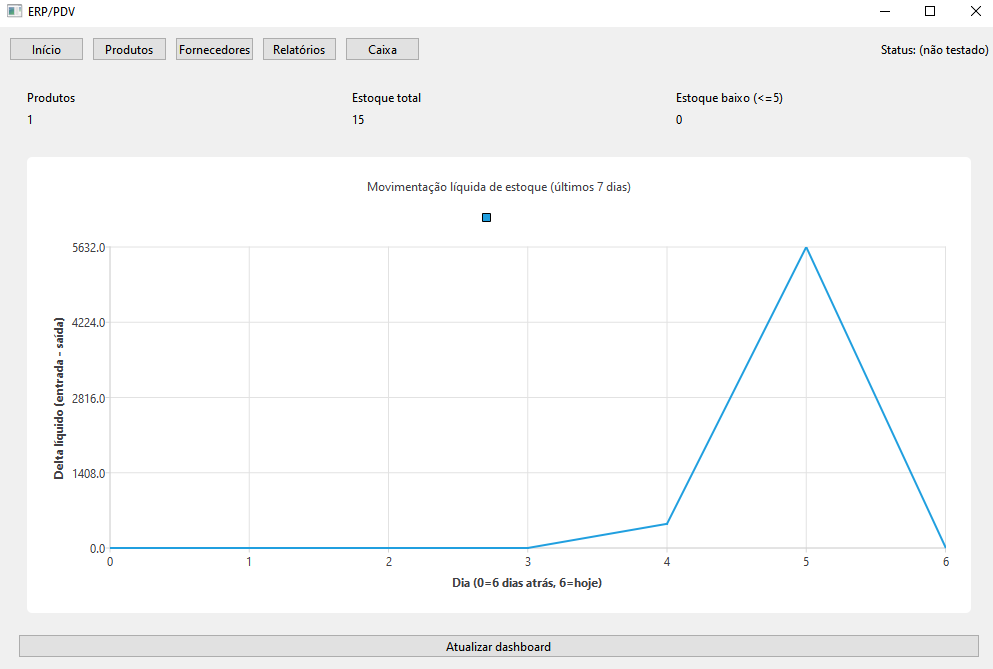
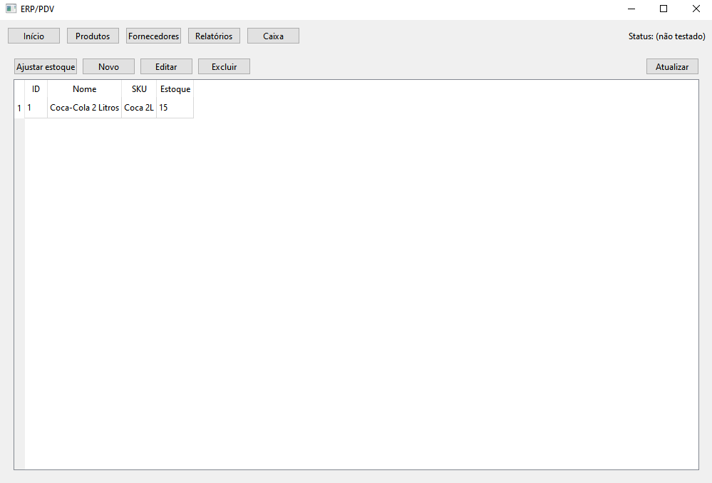
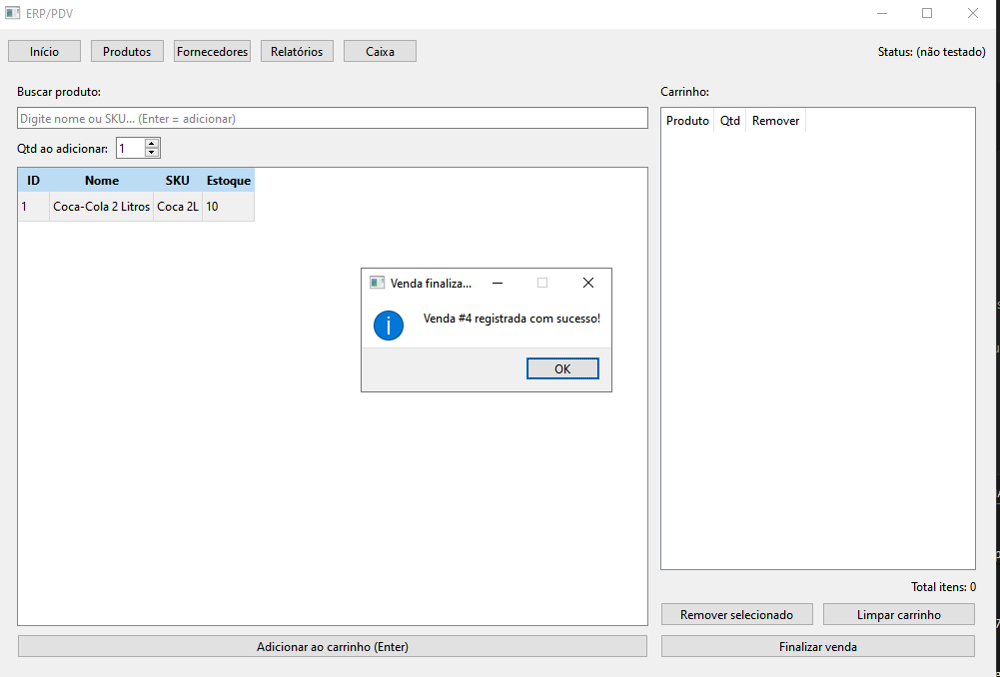
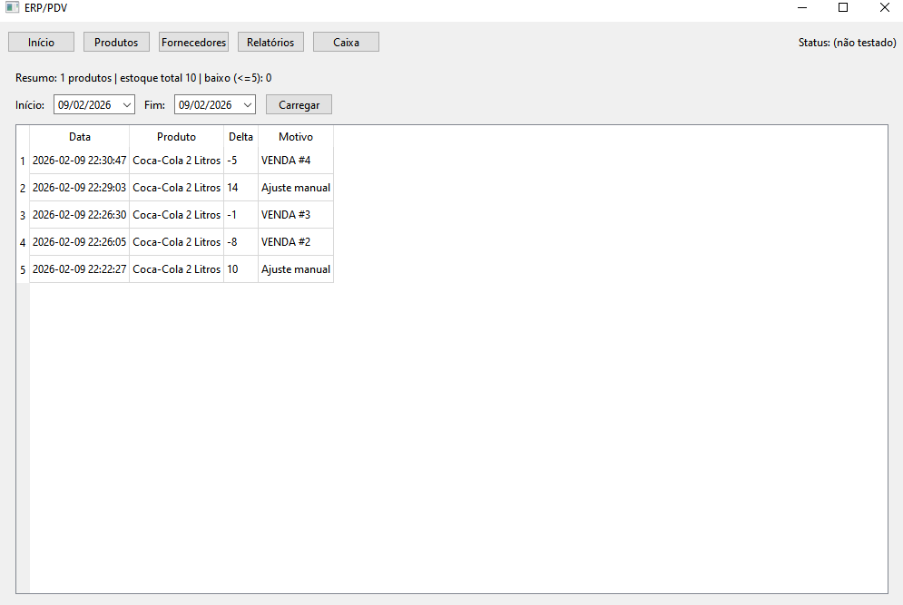

# ERP / PDV Desktop em Python

Sistema **ERP / PDV desktop** desenvolvido em **Python**, com foco em controle de produtos, estoque, vendas (caixa), relatórios e dashboard gerencial.

Projeto criado com objetivo de **estudo prático, portfólio e evolução para um sistema comercial real**.

---

## 🧱 Stack Tecnológica

- **Python 3.11+**
- **PySide6 (Qt)** – Interface desktop
- **FastAPI** – API local
- **SQLAlchemy (async)** – ORM
- **SQLite** (modo local/offline)
- **PostgreSQL** (planejado para multi-PC)
- **Alembic** – Migrations de banco
- Arquitetura **offline-first**

---

## 🚀 Funcionalidades Implementadas

### 📦 Produtos
- Cadastro, edição e exclusão
- SKU opcional
- Controle de estoque em tempo real

### 📊 Estoque
- Ajustes manuais (entrada/saída)
- Histórico de movimentações
- Integração automática com vendas

### 🧾 PDV / Caixa
- Busca rápida por nome ou SKU
- Adição ao carrinho via **Enter**
- Controle de quantidade
- Finalização de venda
- Atualização automática do estoque

### 📈 Dashboard
- Total de produtos
- Estoque total
- Produtos com estoque baixo
- Gráfico de movimentação de estoque (últimos dias)

### 📑 Relatórios
- Resumo geral
- Movimentações por período
- Base para relatórios financeiros

### 🏭 Fornecedores
- Cadastro e listagem
- Estrutura pronta para vínculo com produtos

---

## 🖥️ Screenshots






---

## ⚙️ Como rodar o projeto (Windows)

### 1️⃣ Criar ambiente virtual

```powershell
python -m venv .venv
.\.venv\Scripts\Activate.ps1

2️⃣ Instalar dependências
pip install -U pip
pip install -e .

3️⃣ Configurar ambiente
copy .env.example .env

4️⃣ Rodar aplicação (UI + API)
python -m app.main

🛠️ Banco de dados & Migrations
alembic upgrade head


🗺️ Roadmap (Próximos Passos)
💰 Preço de venda e custo por produto

📉 Relatório de lucro e faturamento

💳 Métodos de pagamento (dinheiro, PIX, cartão)

🧾 Integração com NF-e (estudo)

👤 Usuários e permissões

🌐 Modo multi-PC (PostgreSQL)

🎨 Interface com ícones e tema moderno

📌 Observações
Este projeto não contém dados reais, senhas ou informações sensíveis.
Ideal para estudos, testes e evolução contínua.

🇺🇸 English Version
ERP / POS Desktop in Python
A desktop ERP / POS system built with Python, focused on product management, stock control, sales (point of sale), reports, and management dashboard.

This project was created for practical learning, portfolio building, and future evolution into a real commercial system.

🧱 Tech Stack
Python 3.11+

PySide6 (Qt) – Desktop UI

FastAPI – Local API

SQLAlchemy (async) – ORM

SQLite (local/offline mode)

PostgreSQL (planned for multi-PC usage)

Alembic – Database migrations

Offline-first architecture

🚀 Implemented Features
📦 Products
Create, edit, and delete products

Optional SKU

Real-time stock control

📊 Stock
Manual stock adjustments (in/out)

Stock movement history

Automatic integration with sales

🧾 POS / Cashier
Fast search by name or SKU

Add to cart using Enter

Quantity control

Sale finalization

Automatic stock update

📈 Dashboard
Total products

Total stock quantity

Low stock alerts

Stock movement chart (last days)

📑 Reports
General summary

Stock movement by period

Base structure for financial reports

🏭 Suppliers
Supplier registration and listing

Structure ready for product linkage


⚙️ How to Run (Windows)

1️⃣ Create virtual environment
python -m venv .venv
.\.venv\Scripts\Activate.ps1

2️⃣ Install dependencies
pip install -U pip
pip install -e .

3️⃣ Environment configuration
copy .env.example .env

4️⃣ Run application (UI + API)
python -m app.main

🛠️ Database & Migrations
alembic upgrade head


🗺️ Roadmap
💰 Product cost and pricing

📉 Profit and revenue reports

💳 Payment methods (cash, PIX, card)

🧾 Brazilian NF-e integration (study)

👤 Users and permissions

🌐 Multi-PC mode (PostgreSQL)

🎨 Modern UI with icons and themes

👨‍💻 Author:
Kevin Bertolini

Project developed as part of a professional transition and growth in the technology field.